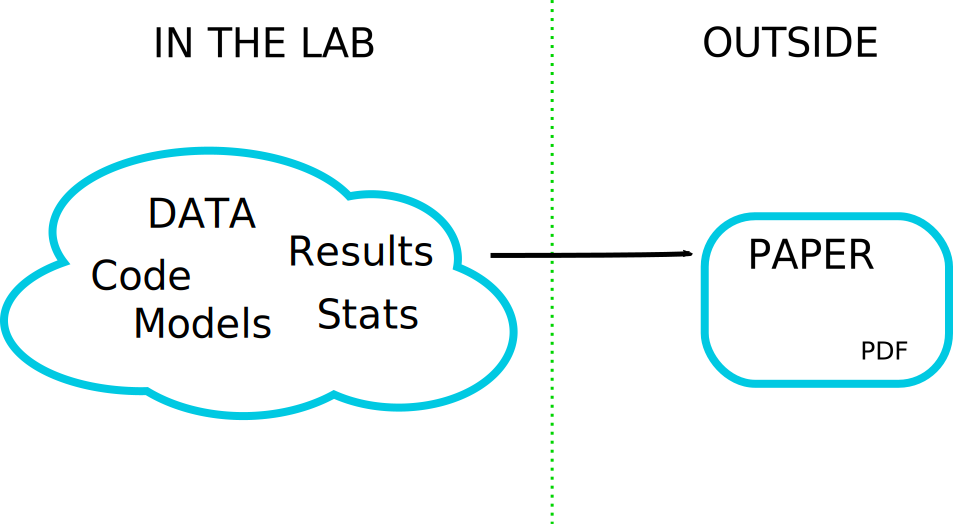
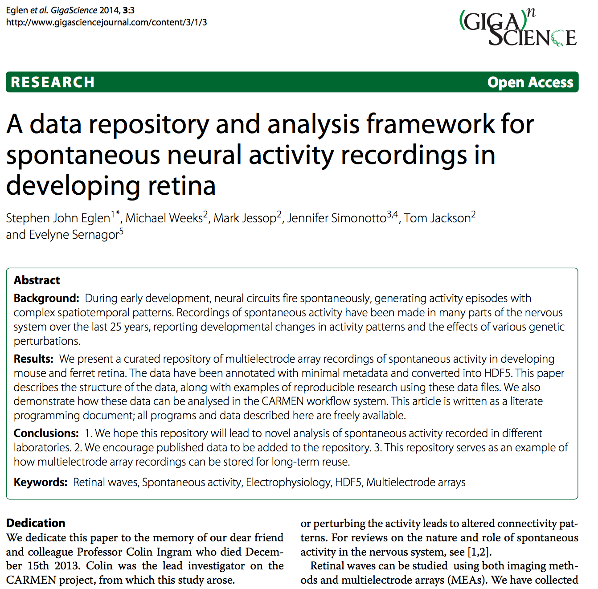
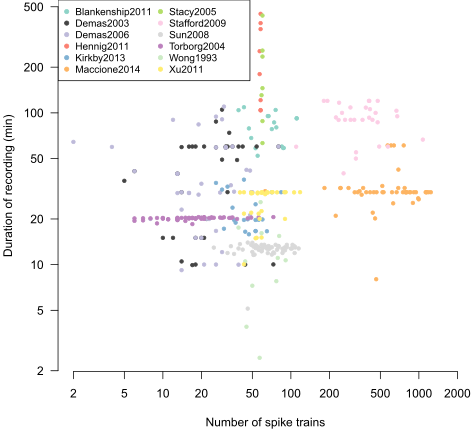
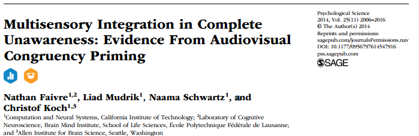

<style>
h2 { 
 color: #3399ff;		
}
h3 { 
 color: #3399ff;		
}
</style>


----

<center></center>

----

<center></center>

<!-- TODO: list items not rendered. -->
<div class="notes">
Started with a project 
European retina meeting 2007.
I will show what we have built and then a couple of _applications_
deriving immediately from it.
This is my *note*.
- It can contain markdown
- like this list
</div>

## What are retinal waves?

<center>
<video id="sampleMovie1" src="./figs/p11ctrlconv.mov" loop="true" autoplay="true" controls></video>
</center>


## What did we do?


- Requested retinal wave data from colleagues.

- Beta 2 knockout mouse was a key focus.

- Handled wide range of data formats.

- Determined what meta data is crucial.

- Converted to a common format, HDF5.


## Datasets

<center></center>

"Basic features of recordings ... We currently have **366** recordings
in the repository, occupying **298** MB on disc"


## Embedding code into documents
<pre>
\begin{figure}[h]
  \centering
  <<nelec-durn-fig,echo=FALSE>>=
  keys.f <- as.factor(keys)
  n.labs <- nlevels(keys.f)
  lab.cols = brewer.pal(n=n.labs, name='Set3')
  lab.cols[2] = "#444444"
  plot(counts, durns/60, log='xy', pch=20, col=lab.cols[keys.f],
         xlab='Number of spike trains',
         xlim=c(2, 2000),
         ylab='Duration of recording (min)', bty='n', las=1)
  legend('topleft', legend=levels(keys.f), cex=0.8,
           ncol=2, col=lab.cols[1:n.labs], pch=19)
  @
\caption{Basic features of recordings in the repository.  ...
We currently have \Sexpr{length(h5.files)} recordings in
the repository, occupying \Sexpr{file.size.mb} MB on disc.
\end{figure}
</pre>

## Full document

<iframe src="copy_waverepo_paper.Rnw"></iframe>

## Why bother?


1. Good for your future self.

2. Good publicity.  [Nature Neuroscience podcast](http://www.nature.com/neurosci/neuropod/index-2014-04-25.html)

3. Good for reviewers ...

## Reviews

<!--- Aside: reviews were signed and are now --->
<!--- [public](http://www.gigasciencejournal.com/content/3/1/3/prepub), [attachment](http://www.gigasciencejournal.com/manuscript/review/attachment/pdf/6813937211125312.pdf) --->

    I would use an ordinate log scale for this bottom right panel (as
    done in Fig.  3). But since the authors gave me everything, I can
    do it! by redefining fourplot as follows:

```{r, include=FALSE,warning=FALSE}
require(sjemea)
data.file <- system.file("examples", "P9_CTRL_MY1_1A.txt",
    package = "sjemea")
s <- jay.read.spikes( data.file)
```

```{r,echo=FALSE,warning=FALSE}
par(mfrow=c(1,2))
plot.corr.index(s)
plot.corr.index(s, log='y')
```


## Good practice

I try to write my papers now in this format, so that I can bundle data
and code with manuscript.

I use [knitr](http://yihui.name/knitr/) but other systems,
e.g. [Jupyter](http://jupyter.org) available.

Docker also makes it easy to test on fresh systems, and for others to
test:

    docker run -d -p 8787:8787 sje30/waverepo
	open http://192.168.59.103:8787/

Login with "rstudio" as username and password.  Open
`waverepo/paper/waverepo_paper.Rnw` and hit the "Compile PDF" button.


## Lessons learnt

- People were willing to give away their *published* data; only one
  group could not find data to share.

- Designing *meta data* is hard.  This version was deliberately minimal
  and lasted approximately two months.
  
- Data papers can be well-received.  Media attention.

- Reproducible research takes a bit longer in the short-term, but
  should benefit in long-term.

More generally:

- Share your data

- Share your code

- Share your papers [http://biorxiv.org](http://biorxiv.org)


## Acknowledgements

- CARMEN project: (Evelyne Sernagor, Jennifer Simonotto, Mike Weeks, Mark
  Jessop, Tom Jackson) 

- Waverepo data providers.

- Ben Marwick (Docker)

- Wellcome Trust, EPSRC, BBSRC, Software Sustainability Institute


<!-- TODO: problem when lines are not separated by blank line. -->

# End


----

<!-- ## Contents of "waverepo" |  (interactive)  -->

<iframe src="http://damtp.cam.ac.uk/user/sje30/waverepo"></iframe>

## Results

Most tables and graphs in our report were automated and recomputed
dynamically, e.g. every time the database extended.

<iframe src="http://www.gigasciencejournal.com/content/3/1/3"></iframe>


# What next

## Journal policies are developing . . .

Since Oct 2014, Nature journals wish to see code relating to papers.

We are now working with Nature Neuroscience on how to check this.


## Open badges: for papers | Open Science Foundation (OSF) badges for papers:

<!--- <center></center> --->

<center>
[](https://osf.io/tvyxz/wiki/home)
</center>

&nbsp;

Started 2013 with reproducibility projects in Psychology and Cancer Biology.


## OSF badge examples

<center></center>

&nbsp;

From its [DOI](http://dx.doi.org/10.1177/0956797614547916) we get to 
[OSF storage](https://osf.io/usfa5/?view_only=1f2e1994fc6247548499f47de64a2650).

e.g. Badge earners in
[Psychological Science](http://www.psychologicalscience.org/index.php/publications/journals/psychological_science/badge-earners).


<!--- https://osf.io/tvyxz/wiki/home/  lists the badges;  "cortex" is also --->
<!--- supposed to offer them, see comment in: --->
<!--- http://blogs.biomedcentral.com/bmcblog/2014/10/07/why-we-need-badges-in-science/#disqus_thread --->
<!--- and that page discusses the taxonomy of contributing. --->
